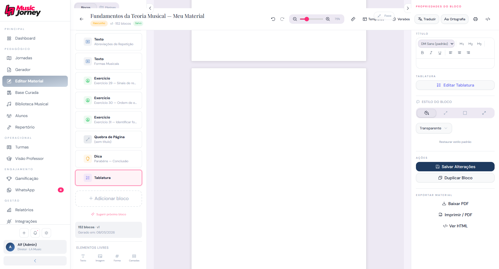
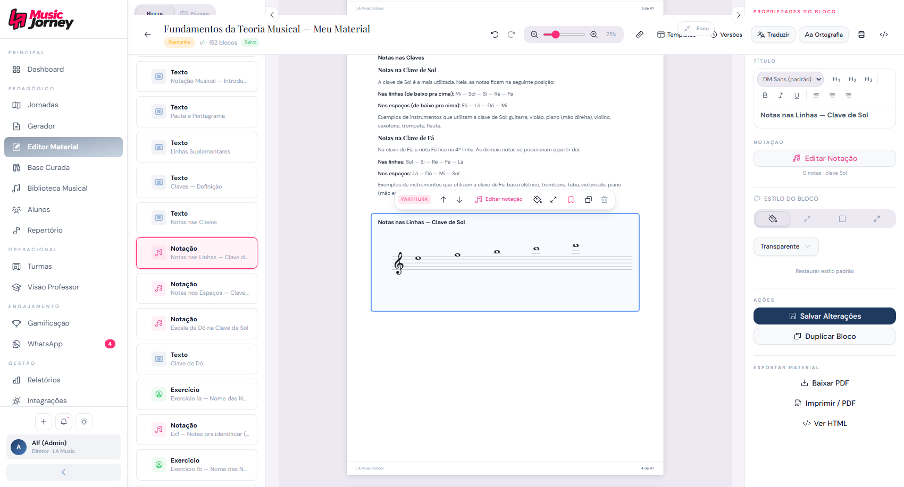
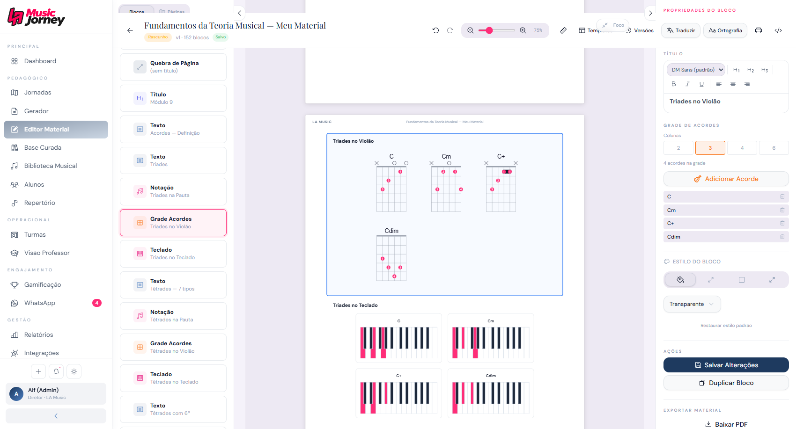

# Tablature HEAD State - 2026-05-09

## Escopo da reversao

Revertido para `HEAD`:

- `src/components/music/TabSvgEditor.tsx`
- `src/components/music/TablatureEditor.tsx`

Removido por nao existir no `HEAD`:

- `src/lib/tablatureAlphaTex.ts`
- `src/lib/__tests__/tablatureAlphaTex.test.ts`

Revertido cirurgicamente:

- `src/components/material/MaterialPreview.tsx`: apenas `BlockTablature` voltou ao comportamento do `HEAD`.

Preservado:

- Pipeline AlphaTab de notacao.
- `onMusicStableRender`.
- Chord grid com `chordLibraryResolver`.
- `src/lib/alphaTabSettings.ts`, porque e arquivo novo usado por `AlphaTabViewer` e `AlphaTexInlineRenderer`.

## Verificacoes tecnicas

- `npm run lint`: passou.
- `npm run build`: passou.
- `src/components/music/TabSvgEditor.tsx`: limpo contra `HEAD`.
- `src/components/music/TablatureEditor.tsx`: limpo contra `HEAD`.
- `src/lib/tablatureAlphaTex.ts`: removido.
- `src/lib/__tests__/tablatureAlphaTex.test.ts`: removido.

## Biblioteca Musical - Tablatura

### Modo Livre

Estado observado no DOM ao abrir a tablatura existente da biblioteca:

- Modal abriu como `Editor de Tablatura`.
- Campo `Compasso` exibiu `Livre (sem compasso)`.
- Item existente exibiu `18 notas - 6 cordas`.
- O AlphaTab dentro do modal expos glyphs de time signature equivalentes a `4/4` no SVG mesmo com o controle em modo livre.

Observacao: a captura de screenshot do modal com AlphaTab falhou por timeout do CDP/browser. Nao foi feita correcao.

### Modo 4/4

Foi possivel trocar o controle para `4/4 - Quaternario` em um modal de nova tablatura durante a validacao, mas a tentativa automatizada de inserir notas por coordenadas focou o capturador de teclado e salvou um item vazio. Nao foi feita nova tentativa de correcao.

Estado registrado:

- A biblioteca passou de `Tablatura (1)` para `Tablatura (2)`.
- Um item `Nova Tablatura` ficou como `Tablatura vazia`.

## Canvas do Material

### Tablatura

Arquivo: `docs/assets/tablature-head-state/03-material-tablature-canvas.png`

Resultado observado:

- Ao selecionar o bloco `Tablatura`, o painel direito reconhece o tipo e mostra `Editar Tablatura`.
- O canvas da pagina fica em branco para esse bloco, sem renderizacao visual da tablatura.
- Este estado foi apenas documentado, sem correcao.

### Notacao

Arquivo: `docs/assets/tablature-head-state/04-notation-canvas-check.png`

Resultado observado:

- Notacao `Notas nas Linhas - Clave de Sol` renderiza no canvas.
- Nao foi observado bloco em branco neste caso.

### Chord Grid

Arquivo: `docs/assets/tablature-head-state/05-chord-grid-canvas-check.png`

Resultado observado:

- `Triades no Violao` renderiza com diagramas `C`, `Cm`, `C+`, `Cdim`.
- `Triades no Teclado` tambem aparece abaixo.
- Chord grid continuou funcional apos a reversao da tablatura.

## Console

O editor abriu sem crash de tela, mas havia mensagens no console:

- Warnings Radix UI: `Missing Description or aria-describedby={undefined} for DialogContent`.
- Erros React: `The final argument passed to useEffect changed size between renders`.

Nao foi feita correcao nesta passada.

## Conclusao factual

Depois de voltar `TablatureEditor.tsx` e `TabSvgEditor.tsx` para `HEAD`, a tablatura ainda nao esta comprovadamente aceitavel:

- No modal da biblioteca, modo livre ainda aparenta expor glyphs de formula de compasso do AlphaTab.
- No canvas do material, o bloco de tablatura selecionado ficou em branco.
- Notacao e chord_grid permaneceram funcionais na validacao visual.
